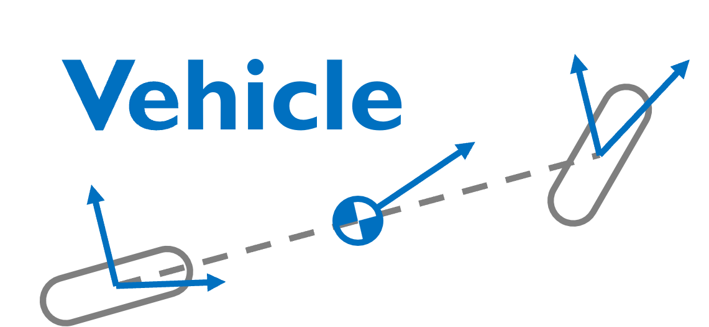

<p align="center">
  
</p>

<p align="center">
  <strong>Vehicle dynamics blocks for PathSim</strong>
</p>

<p align="center">
  <a href="https://pypi.org/project/pathsim-vehicle/"></a>
  
</p>

<p align="center">
  <a href="https://docs.pathsim.org/vehicle">Documentation</a> &bull;
  <a href="https://pathsim.org">PathSim Homepage</a> &bull;
  <a href="https://github.com/pathsim/pathsim-vehicle">GitHub</a>
</p>

---

PathSim-Vehicle extends the [PathSim](https://github.com/pathsim/pathsim) simulation framework with blocks for vehicle dynamics. All blocks follow the standard PathSim block interface and can be connected into simulation diagrams.

## Features

- **Kinematic bicycle model** — 4-state model (position, heading, speed) suitable for low-to-moderate speeds and path planning
- **Dynamic bicycle model** — 6-state model with linear tire forces for higher-fidelity lateral dynamics
- **Vehicle parameter sets** — including Hyundai Azera test vehicle from Kong et al. (IEEE IV 2015)
- **Input constraints** — steering angle/rate and acceleration/jerk bounds

## Install

```bash
pip install pathsim-vehicle
```

## License

MIT
